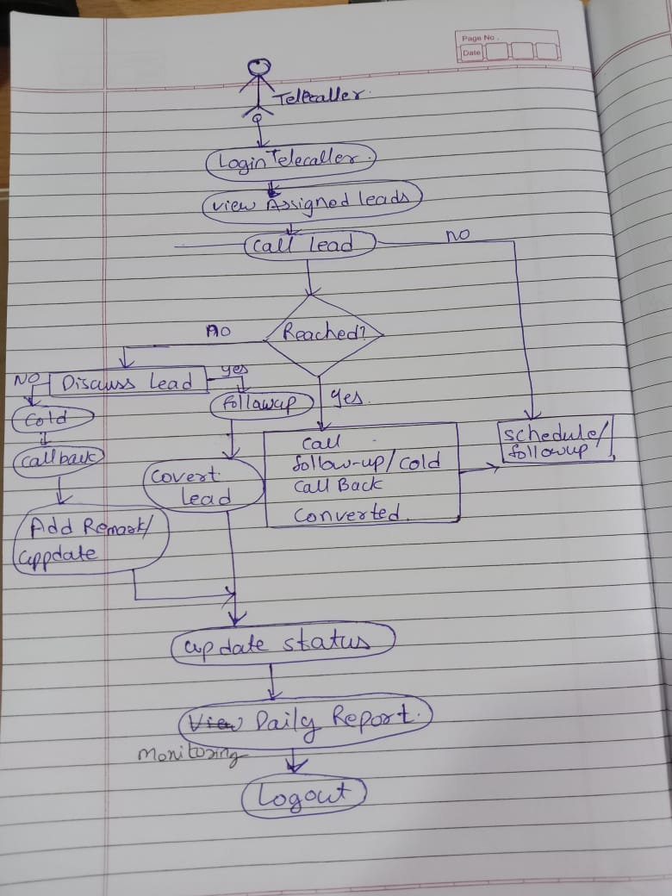
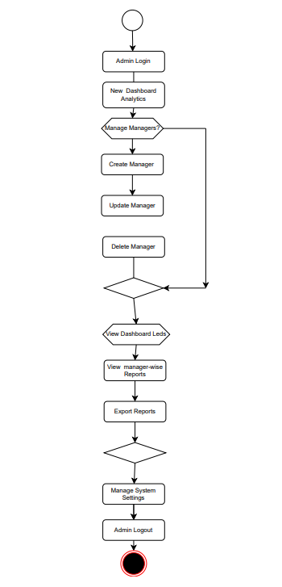

# 🚀 ExtraaEdge – Lead Management & Telecalling CRM System

## 📌 Overview

**ExtraaEdge** is a real-world inspired **Lead Management and Telecalling CRM System** built using the **MERN Stack (MongoDB, Express.js, React.js, Node.js)**.
It streamlines the complete lead lifecycle — from **lead upload and assignment** to **telecalling activities and final conversion** — using a secure, role-based workflow.

---

## 🎯 Project Objectives

* Centralized and efficient lead management
* Role-based authentication and authorization
* Telecaller activity tracking and reporting
* Real-time analytics and performance monitoring
* Hands-on experience with full-stack development

---

## 👥 User Roles & Responsibilities

### 🔑 Admin

* Manage managers (CRUD operations)
* View system-wide dashboards and analytics
* Generate and export lead reports
* Full system access

### 📋 Manager

* Upload leads using Excel sheets
* Assign and reassign leads to telecallers
* Monitor telecaller performance
* Upload WhatsApp proof screenshots

### 📞 Telecaller

* View assigned leads only
* Perform call activities
* Update lead status (Follow-up, Callback, Converted, Cold)
* Add remarks and view daily activity reports

---

## ⚙️ Key Features

* 🔐 Role-based Login & Access Control
* 📂 Excel-based Lead Upload
* 🔁 Lead Assignment & Tracking
* 📞 Call History & Activity Timeline
* 🔔 Notification System
* 💬 WhatsApp Integration (Mock)
* 📊 Advanced Reports & Analytics
* 📤 Export Reports (Excel / CSV / PDF)

---

## 🧩 System Modules

* Authentication Module (JWT)
* Lead Management Module
* Telecalling Activity Module
* Reporting & Analytics Module
* Notification Module

---

## 🛠️ Technology Stack

* **Frontend:** React.js, Bootstrap / Tailwind CSS
* **Backend:** Node.js, Express.js
* **Database:** MongoDB
* **Authentication:** JWT
* **File Upload:** Multer
* **Charts & Analytics:** Chart.js / Recharts

---

## 📐 UML Diagrams

* Use Case Diagram
* Activity Diagram
* ER Diagram

These diagrams help visualize system functionality, workflow, and data relationships.

---

## 🎓 Learning Outcomes

* Practical MERN stack development experience
* Understanding of real-world CRM workflows
* REST API design and implementation
* Role-based system architecture
* Database schema modeling

---

## 🏁 Conclusion

The **ExtraaEdge CRM System** delivers an end-to-end solution for managing leads and telecalling operations.
It closely simulates an industry-level CRM application and prepares students to build **scalable, real-world software systems**.

---

02/01/2026 (Rashmi Patil,Piyushi Agrawal,Samruddhi Athare): 

## Use Case Diagrams

### Admin Use Case

### Telecaller Use Case

### Telecaller Extended Use Case

03/01/2026 

### Adimin Activity Final (Samruddhi Athare)

